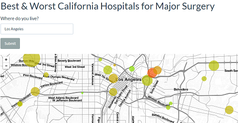
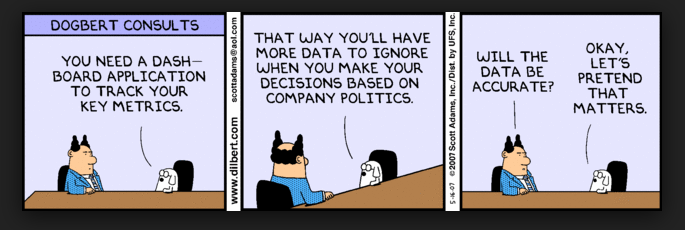
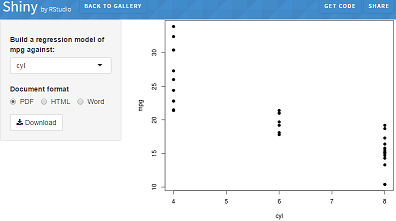
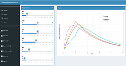
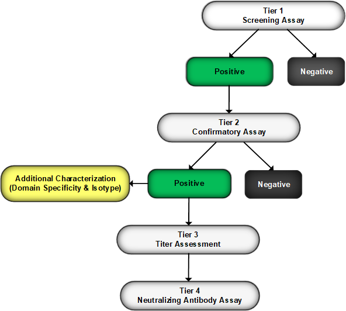

<style type="text/css">

slides > slide:before {
  font-size: 12pt;
  content: 'http://shiny.rstudio.com/';
  position: absolute;
  text-align: center;
  bottom: 15px;
  left: 50%;  
  margin-left: -300px;
  width: 600px;
  line-height: 1.9;
}

div.img-col{
  text-align: center;
  font-size: 14pt;
}

a {
  border-bottom: none !important;
}

.wrapper {
  margin: 70px auto;
  position: relative;
  z-index: 90;
}

.ribbon-wrapper-green {
  width: 145px;
  height: 148px;
  overflow: hidden;
  position: absolute;
  top: -3px;
  right: -3px;
}

.ribbon-green {
  font: bold 15px Sans-Serif;
  color: #333;
  text-align: center;
  text-shadow: rgba(255,255,255,0.5) 0px 1px 0px;
  -webkit-transform: rotate(45deg);
  -moz-transform:    rotate(45deg);
  -ms-transform:     rotate(45deg);
  -o-transform:      rotate(45deg);
  position: relative;
  padding: 7px 0;
  left: -25px;
  top: 45px;
  width: 220px;
  background-color: #7ADCBF;
  background-image: -webkit-gradient(linear, left top, left bottom, from(#8AACDF), to(#658FBE)); 
  background-image: -webkit-linear-gradient(top, #8AACDF, #658FBE); 
  background-image:    -moz-linear-gradient(top, #8AACDF, #658FBE); 
  background-image:     -ms-linear-gradient(top, #8AACDF, #658FBE); 
  background-image:      -o-linear-gradient(top, #8AACDF, #658FBE); 
  color: #6a6340;
  -webkit-box-shadow: 0px 0px 3px rgba(0,0,0,0.3);
  -moz-box-shadow:    0px 0px 3px rgba(0,0,0,0.3);
  box-shadow:         0px 0px 3px rgba(0,0,0,0.3);
}

.ribbon-green:before, .ribbon-green:after {
  content: "";
  border-top:   3px solid #00896e;   
  border-left:  3px solid transparent;
  border-right: 3px solid transparent;
  position:absolute;
  bottom: -3px;
}

.ribbon-green:before {
  left: 0;
}
.ribbon-green:after {
  right: 0;
}
</style>

# Session Outline & Goals

## You will learn:
- Setup
- Data Visualization Landscape in R
- R Markdown
- Shiny
- Deploying Visualizations, Dashboards & Apps

## Outline

### We'll Cover Three Main Areas:
<div class="columns-2">
- ggplot2
- R Markdown
- Shiny

<div class="img-col">

   
 </div>
</div>

## Development Process
- ["I created a quick plot, that then turned into a R Notebook, that then turned into an interactive dashboard."](https://www.linkedin.com/pulse/its-nonlinear-world-interactive-dashboard-edgar-ruiz/)

## My Story & How I Got Here
### About:
 - CS Background
 - B2S Life Sciences
 - Book Note - Statistical Methods for Immunogenicity Assessment

## Empowered to Build Powerful Visualizations, Reports & Apps
- ["R is a fantastic environment for the rapid exploration of in-memory data"](https://peadarcoyle.wordpress.com/2015/08/02/interview-with-a-data-scientist-hadley-wickham/)
- http://www.acop7.org/previous-acop-meetings-acop7-posters

## Live Data Visualization Pharma Tools/Apps
- http://webpopix.org/shiny/ShinyExamples.html
- https://gallery.shinyapps.io/genome_browser/
- https://www.bioconductor.org/packages/release/data/experiment/vignettes/RforProteomics/inst/doc/RProtVis.html
- http://omimexplorer.research.bcm.edu:3838/omim_explorer/
- https://canvasxpress.org/html/index.html

## NDA's & R

- Review clin/pharm sections of NDA's with R graphics/analyses
- R in Clin pharm for nonlinear mixed effects modeling and subsequent graphical analysis
- https://www.accessdata.fda.gov/drugsatfda_docs/nda/2016/208573Orig1s000ClinPharmR.pdf
- https://www.accessdata.fda.gov/drugsatfda_docs/nda/2017/209296Orig1s000ClinPharmR.pdf
- https://channel9.msdn.com/Events/useR-international-R-User-conference/useR2016/Using-R-in-a-regulatory-environment-FDA-experiences
- https://cran.r-project.org/web/packages/ggplot2/index.html
- https://uupharmacometrics.github.io/xpose/
- https://cran.r-project.org/web/views/ClinicalTrials.html
- https://www.r-project.org/doc/R-FDA.pdf
 
 
 
 
 
 
 
 
 


## Setup

- R
- Packages
- IDE
- Projects
- Sessions
- Git/Github
- RSC
- Shiny
- Repeatable & Reproducible

## How Do I Use R After Workshop?
- R Review
- Not a R Intro but also No prior knowledge of R, RStudio or Shiny is needed
- https://cran.r-project.org/
- https://cran.r-project.org/web/packages/available_packages_by_name.html
- https://www.rstudio.com/products/rstudio/download/#download
- https://www.rstudio.com/products/rstudio/download-server/
- https://rstudio.cloud/projects
- https://www.linkedin.com/pulse/installing-r-rstudio-windows-edgar-ruiz/

## Training Environment... RStudio Server
- https://www.edgarsdatalab.com/2017/11/24/setup-an-rstudio-server-in-ubuntu/
- https://www.edgarsdatalab.com/2016/08/25/setup-a-shiny-server-in-aws/


## IDE LET’S EXPLORE...
- getwd()
- installed.packages()
- .libPaths()
- Install a package...how about one from here:
- https://gallery.shinyapps.io/087-crandash/
- User library
- System library
- https://juliasilge.com/blog/navigating-packages/

## PACKAGES LET’S EXPLORE...
- writeLines(capture.output(sessionInfo()), "sessionInfo.txt")
- writeLines(capture.output(devtools::session_info()), "devsessionInfo.txt")
- packageVersion("tidyverse")
- https://support.rstudio.com/hc/en-us/articles/219949047-Installing-older-versions-of-packages
- http://manishbarnwal.com/blog/2016/10/05/install_a_package_particular_version_in_R/
- https://github.com/r-lib/sessioninfo
- https://support.rstudio.com/hc/en-us/articles/360002242413-Multiple-versions-of-R

## IDE LET’S EXPLORE More...
- library(tidyverse)
- https://support.rstudio.com/hc/en-us/articles/215733837-Managing-libraries-for-RStudio-Server
- https://cran.r-project.org/doc/manuals/r-release/R-admin.html#Managing-libraries
- In shell, run "tree"

## Tribbles!..

<div class="columns-2">
- Another way to create a tibble is with tribble(), short for transposed tibble
- http://r4ds.had.co.nz/tibbles.html

 <div class="img-col">
   
   
   <div>CC image courtesy CBS Home Entertainment<br /> of <a href="http://www.treknews.net/2017/07/31/star-trek-discovery-tribbles-pg13/">The Trouble </a> With Tribbles</div>
 </div>
</div>

- Darn quadrotriticale

## Tibble Example

```{r}
library(tibble)
#library("tidyverse")
storms <-tribble(
~storm, ~wind, ~pressure, ~date,
"Alberto", 110, 1007, "2000-08-12",
"Alex", 45, 1009, "1998-07-30",
"Allison", 65, 1005, "1995-06-04",
"Ana", 40, 1013, "1997-07-01",
"Arlene", 50, 1010, "1999-06-13",
"Arthur", 45, 1010, "1996-06-21"
)

# filter(storms, wind == 45)

```

# ggplot2

## Common Reporting Tasks - ggplot2

<div class="columns-2">
- [Plotting system for R](https://rpubs.com/hadley/ggplot2-toolbox)
- [Created by Hadley Wickham](http://ggplot2.org/)
- [Powerful graphics language for creating elegant and complex plots](http://www.cookbook-r.com/Graphs/)
- [ggplot2 is a graphing library for R. Use ggplot2 with Plotly to create interactive, online ggplot2 charts with D3.js.](https://plot.ly/ggplot2/)
- [ggvis is a data visualization package for R](http://ggvis.rstudio.com/)

<div class="img-col">
<a href="https://ramnathv.github.io/pycon2014-r/visualize/ggplot2.html"></a>


</div>

## A ggplot2 template - Make any plot by filling in the parameters of this template

```{r}
#ggplot(data = <DATA>) +
#<GEOM_FUNCTION>(mapping = aes(<MAPPINGS>))
```

```{r fig.height = 3, fig.width = 5}
library(ggplot2)
ggplot(data = mpg) +
geom_point(mapping = aes(x = displ, y = hwy))
```

## Storms example
```{r}
library(ggplot2)
ggplot(data = storms) +
geom_point(mapping = aes(x = wind, y = pressure))

```

## Tools that build on ggplot2
- https://radiant-rstats.github.io/docs/
- https://www.bioconductor.org/packages/devel/bioc/vignettes/bioCancer/inst/doc/bioCancer.html
- https://uupharmacometrics.github.io/xpose/articles/cheatsheet.pdf
- Toothgrowth_Notebook.Rmd


# htmlwidgets

## Live HTML Widgets Examples

<div class="columns-2">
- [Genomic data for antibiotic resistant strains of mycobacterium tuberculosis by Amanda Winburn & others](https://hmdc.shinyapps.io/genTB/)
- [Best & Worst California Hospitals for Surgery by Gary Chung
](https://gchung.shinyapps.io/CAhospitals/)
- [canvasXpress - developed as the core visualization component for bioinformatics and systems biology analysis at Bristol-Myers Squibb by Isaac Neuhaus
](http://canvasxpress.org/)
- [Visualizing U.S. Clinical Trials
](https://gchung.shinyapps.io/CTgov/)

<div class="img-col">
 </div>

</div>

## HTML Widgets R Bindings to JavaScript Libraries

<div class="columns-2">

- Used at the R console for data analysis just like conventional R plots (via RStudio Viewer).
- Seamlessly embedded within R Markdown documents and Shiny web applications.
- Saved as standalone web pages for ad-hoc sharing via email, Dropbox, etc.
- 1_htmlwidgets_Leaflet_Starbucks
<div class="img-col"><a href="http://www.htmlwidgets.org/showcase_leaflet.html"></a>
 </div>
 
</div>

## Common Reporting Tasks - rpivotTable & DT

<div class="columns-2">
- [rpivotTable - Package created by Enzo Martoglio](https://github.com/smartinsightsfromdata/rpivotTable)
- [DT: An R interface to the DataTables library by RStudio](https://rstudio.github.io/DT/)

<div class="img-col"><a href="http://hafen.github.io/htmlwidgetsgallery/"></a>
   
 </div>
</div>

</div>

## Futher Reading
- https://rstudio.github.io/r2d3/articles/learning_d3.html
- https://rstudio.github.io/r2d3/index.html
- https://rstudio.github.io/r2d3/articles/package_development.html


# R Markdown

## Live R Markdown Pharma Examples

<div class="columns-2">
- [Monitor Clinical Research](https://jenthompson.me/2018/02/09/flexdashboards-monitoring/)
- [Cancer prediction using caret by JESUS M. CASTAGNETTO](https://rpubs.com/jesuscastagnetto/caret-knn-cancer-prediction)
- [TCGA prostate cancer differential expression by race
by Levi Waldron](https://rpubs.com/lwaldron/TCGA_prad)
- [GLMM with various R packages
by Kazuki Yoshida](https://rpubs.com/kaz_yos/glmm1)
- [A not so short review on 
survival analysis in R](http://rpubs.com/alecri/258589)
- [Access to Hospital Care Dashboard](http://colorado.rstudio.com/rsc/content/154/)
- [Comparative Protein Structure Analysis with Bio3D](http://rpubs.com/xqyao/bio3d_pca)
- [Survival Analysis Example](https://rpubs.com/mjeagle/Surv)

<div class="img-col">
 </div>

</div>

## R Markdown - Benefits & Features

<div class="columns-2">
 - Markdown is a particular type of markup language.
 - Markup languages are designed produce documents from plain text.
 - Existing R code can be used within R Markdown & reports can be parameterized
 - Easy creation of dynamic documents, presentations, and reports
 - Framework for writing reproducible reports from R
 
<div class="img-col">
   
 </div>
</div>

## What can I do with RMD?

- Write a book http://adv-r.had.co.nz/
- Write a blog https://rviews.rstudio.com
- Create a website http://rmarkdown.rstudio.com/
- Add a vignette to a package http://yihui.name/knitr/demo/vignette/
- Publish research https://github.com/rstudio/rticles
- Automate reporting https://github.com/philbowsher/Job-Scheduling-R-Markdown-Reports-via-R
- Make PowerPoints https://github.com/nwstephens/rmd2ppt
- Preserve your sanity and look back at your workflow

## rmarkdown Parameters -- `1_RMD_Stocks`

- Parameters are useful when you want to re-render the same report with distinct values for various key inputs
- R Markdown documents can include one or more parameters whose values can be set when you render the report
- https://rmarkdown.rstudio.com/developer_parameterized_reports.html
- https://rmarkdown.rstudio.com/lesson-6.html

# Genius of R Markdown...

## Part 2.0 - R Notebooks

<div class="columns-2">
- [Notebooks](http://rmarkdown.rstudio.com/r_notebooks.html)
- [Notebook Background](https://rviews.rstudio.com/2017/03/15/why-i-love-r-notebooks/)
- Leonardo da Vinci…Page from the Codex Atlanticus shows notes and images about water wheels and Archimedean Screws
- Combine in a single document: Narrative, Code, Output & then Render to HTML

<div class="img-col">
<a href="https://blog.rstudio.com/2016/10/05/r-notebooks/"></a>

</div>

## Intro to RMD - flexdashboard - Create Data Visualizations as a Dashboard

<div class="columns-2">
- [flexdashboard](http://rmarkdown.rstudio.com/flexdashboard/)
- [Gene Expression Biclustering - Bryan Lewis](https://jjallaire.shinyapps.io/shiny-biclust/)
- [Iris K-Means Clustering](https://jjallaire.shinyapps.io/shiny-kmeans/)

<div class="img-col">
<a href="https://jjallaire.shinyapps.io/shiny-biclust/"></a>

</div>

## So where can I deploy my R Markdown dashboard?
- R Markdown websites are static HTML pages that can be deployed to any standard web server
- Via email
- GitHub Pages
- Amazon S3 or EC2
- Rpubs
- beta.rstudioconnect.com
- http://alignedleft.com/resources/cheap-web-hosting


# Shiny

## Shiny Motivation

<div class="columns-2">
 - Analysis must be communicated
 - Data scientists are modern diviners
 - We sit between the tools and users
 - Deliver static reports
 - Impoverished perspective into analysis
 - https://github.com/jcheng5

 <div class="img-col">
   
   
   <div>Altered CC image courtesy <br /> of <a href="https://www.flickr.com/photos/mcgraths/">mcgraths</a> on flickr</div>
 </div>
</div>

## Live Shiny Pharma Examples

<div class="columns-2">
- [Build your PK model by Marc Lavielle using the mlxR package at http://simulx.webpopix.org/ ](http://shiny.webpopix.org/dashboard/pkmodel/) & [here](http://webpopix.org/shiny/ShinyExamples.html)
- [medplot by Crt Ahlin & Lara Lusa to  facilitate the exploration and analysis of longitudinal data](http://shiny.mf.uni-lj.si/medplot/)
- [Bioequivalence v0.3 by Andrey Ogurtsov](https://statist.shinyapps.io/bioeq_en/)

<div class="img-col">

   
 </div>
</div>

## Shiny
### About:
 - Interactive web application framework for R
 - Create and share applications with others
 - Expects no knowledge of web technologies like HTML, CSS, or JavaScript (but you can leverage them, if you know them)

### Benefits & Features:
 - Accessible to non-programmers
 - Great for exploratory data analysis, visualizations & dashboards
 - Utilize existing R code
 
## You Need a Dashboard!

<div class="columns-4"></a>

</div>


## shinydashobard information 

- [How to develop a Shiny dashboard](http://db.rstudio.com/best-practices/dashboards/)
- [Intro to dashboards](https://github.com/rstudio/bigdataclass2018/blob/master/assets/workbook/09-dashboards.Rmd)
- [CDC PrEP Guidelines](https://prism.shinyapps.io/cdc-prep-guidelines/)
- [CDC Zika Data](https://chendaniely.shinyapps.io/zika_cdc_dashboard/)
- [shinydashboard](https://rstudio.github.io/shinydashboard/)
- [Material design in Shiny apps](https://ericrayanderson.github.io/shinymaterial/)
- https://www.rstudio.com/resources/videos/dashboards-made-easy/


# Combining Shiny & R Markdown

## You see, right now, we have Relationship Shiny, but there is also Independent Shiny...

<div class="columns-4"></a>

https://beta.rstudioconnect.com/content/2671/Combining-Shiny-R-Markdown.html

</div>

## Shiny/R Markdown Examples

<div class="columns-2">
- [FDA Adverse (Drug) Event Dashboard](https://github.com/statwonk/openfda-dashboard)
- [interAdapt - An Interactive Planner for Group Sequential, Adaptive Enrichment Designs](https://michaelrosenblum.shinyapps.io/interAdapt/)
- [Export a report from Shiny - Simple Example](http://shiny.rstudio.com/gallery/download-knitr-reports.html)
 - [AplusB: A + B design investigator for phase I dose-escalation studies](https://graham-wheeler.shinyapps.io/AplusB/)

<div class="img-col">
   
 </div>
</div>

</div>


# Deploy

## So where can I deploy my Shiny app?
- shinyapps.io
- Shiny Server
- RStudio Connect beta.rstudioconnect.com

## shiny Package & Shiny Server

<table width="100%" style="border-spacing: 50px; border-collapse: separate; margin: -50px auto;">
<tr>
<td style="vertical-align: top; padding-top: 1em">
### shiny Package
Shiny is an open source R package that provides a web framework for building interactive web applications using R.
</td>
<td></td>
</tr><tr>
<td style="vertical-align: top; padding-top: 1em">
### Shiny Server
Shiny Server is a server program that lets you host and manage shiny web applications and interactive documents online.
</td>
<td></td>
</tr>
</table>

## Deploy as a Package/Shiny Gadget
- https://www.r-statistics.com/2016/11/ggedit-interactive-ggplot-aesthetic-and-theme-editor/
- [Shiny Gadgets](https://github.com/philbowsher/RStudio-Addins-Shiny-Gadgets)
- https://github.com/calligross/ggthemeassist
- https://will-landau.com/2016/11/01/appPackage/
</div>


# Sources for Adverse Events & Clinical Drugs Data

## What are Adverse Events (AEs)?
- The openFDA drug adverse event API returns data from the FDA Adverse Event Reporting System (FAERS)
- FAERS, a database that contains information on adverse event and medication error reports submitted to FDA
- An adverse event is submitted to the FDA to report any undesirable experience associated with the use of a medical product in a patient
- Adverse events are collected through a series of safety reports
- Adverse event reports submitted to FDA do not undergo extensive validation or verification
- http://www.gersonides.com/openfda/
- https://open.fda.gov/data/faers/


## OpenFDA Analysis - R Markdown Report Demo - pharmarmd.Rmd

<div class="columns-2">
- [ropenhealth/openfda](https://github.com/rOpenHealth/openfda)
- [openFDA API endpoint for adverse drug events](https://open.fda.gov/drug/event/)
- [openfda-dashboard information](https://github.com/statwonk/openfda-dashboard/blob/master/about2.Rmd)
- [openFDA reference guide](https://open.fda.gov/drug/event/reference/)
- [Ten things to know about drug adverse events](https://open.fda.gov/update/ten-things-to-know-about-adverse-events/)
- [Example](https://open.fda.gov/static/docs/openFDA-analysis-example.pdf)

<div class="img-col">
<a href="https://open.fda.gov/update/drilling-into-the-details/"></a>


</div>

</div>

## OpenFDA AE App
- https://diabetescheck.shinyapps.io/openfda-dashboard/
- https://openfda.shinyapps.io/dash/?t1=aspirin&v1=patient.drug.openfda.generic_name
- https://open.fda.gov/update/ten-things-to-know-about-adverse-events/#use-exact-to-count-for-phrases
- https://open.fda.gov/api/reference/


## Bigquery
- RxNorm (created by the U.S. National Library of Medicine (NLM)) to provide a normalized naming system for clinical drugs will be used for drug analytics
- https://cloud.google.com/bigquery/public-data/rxnorm


## Generating Adverse Events Data for Immunogenicity App
- https://github.com/waddella/phuse2016_adverse_events
- POC Database Version...


# Sean...Live Development - GGplot2, RMD, Shiny 


# Part 2


# Biopharmaceuticals

## Top 10 U.S. Drugs

- https://en.wikipedia.org/w/index.php?title=List_of_largest_selling_pharmaceutical_products
- https://www.fiercepharma.com/special-report/top-20-drugs-2020-worldwide-sales
- Monoclonal antibodies now comprise the predominant category of the biotherapeutics undergoing development

## Protein Drugs – Increased Size... Results in Increased Complexity

- Unlike traditional small molecule drugs, they posses a high ordered structure
- Oxytocin 1,007 Da
- Insulin 5,808 Da
- Therapeutic mAb 150,000 Da
- Safety and Efficacy concerns, Assessment of Biosimilarity
- Monoclonal, Polyclonal Antibody

## What is Immunogenicity?
- Immunogenicity is characterized by the presence of antidrug antibodies (ADAs) detected in the circulation of either animals or humans after administration of a biopharmaceutical
- Ability of an agent to provoke an immune response
- Traditional small molecule drugs rarely elicit formation of antibodies
- Repeated administration of biotech drugs frequently results in unwanted formation of ADA (anti-drug Abs)
- Two types: “Wanted” -> Vaccines & “Unwanted” -> ADA (anti-drug Abs) [Van Beers et al. 2010]
- Therapeutic use of monoclonal antibodies is often associated with immunogenicity (Remicade USPI 2015)

## FDA’s Immunogenicity Draft Guidance (Dec. 2009)
- https://www.fda.gov/downloads/Drugs/Guidances/UCM192750.pdf
- Evaluating the immunogenicity of biopharmaceuticals is mandatory for regulatory approval


## Tiered Process - Testing Scheme for Detection & Characterization of ADA

<div class="columns-4"></a>

</div>

## Tiered Process

- Tier 1: Identify “reactive” samples: Samples with signal above screening cut-point
- Tier 2: Identify “Ab+” samples by testing reactive samples in the absence and presence of drug: Samples with percent inhibition above confirmatory cut-point
- Tier 3: Determine a sample titer value by serial dilution of Ab+ samples in Tier 2: Titer is based on the screening cut-point or a higher “titer cut-point”. Can be continuous (requires interpolation) or discrete
- Tier 4: Evaluate neutralizing effects of antibodies: Usually based on cell-based bioassay using Ab+ samples


## Schaarschmidt et al - R!

- Statistical approaches for the determination of cut points in anti-drug antibody bioassays
- https://www.ncbi.nlm.nih.gov/pubmed/25733352
- "All methods discussed are available in the corresponding R add-on package mixADA"
- Normalization assuming normal and log-normal distribution 
- Testing normal vs. log-normal distribution in the mixed model
- "Therefore, our approach, which is mirrored in mixADA software, is a parallel estimation of the SCP assuming an underlying normal and log-normal distribution"
- "Specific R algorithms were provided and summarized in the user-friendly program mixADA, providing diagnostic tools and optional model choice"


## Shankar & Co-workers 2014 & 2015 Reporting
- https://www.ncbi.nlm.nih.gov/pmc/articles/PMC4070270/
- https://www.ncbi.nlm.nih.gov/pubmed/25850051


## Shiny Development Example - 4_Shiny_Immunogenicity_3Tier

- shinydashboard
- https://github.com/rstudio/bigdataclass2018/blob/master/assets/workbook/09-dashboards.Rmd
- ADA three‐tiered testing strategy is deployed to assess ADA on sample data.
- [Example](https://beta.rstudioconnect.com/content/2769/)
- http://www.covance.com/content/dam/covance/assetLibrary/whitepapers/adawhitepaperpdf.pdf


## Ability to Investigate Adverse Events with Respect to Emergence of Antibody Responses in Patients
- Key Question about immunogenicity….
- Does the administration of a biotherapeutic drug elicit formation of anti-drug antibodies (aka immunogenicity) in patients?
- If yes, does a relationship exist between immunogenicity (emergence of antibodies in patients) and the spectrum of adverse events (safety) and their severity?
- If yes, is there a relationship between immunogenicity and a change in drug efficacy?
- If yes, do the antibodies alter drug exposure or its pharmacokinetic properties?


## Databases - Connect R to	your data

- Explore your databases using the RStudio IDE
- Develop and deploy Shiny applications	that connect on databases
- Learn best practices for using R with	your databases
- Connection	Wizard
- Connections	Tab
- https://blog.rstudio.com/2017/08/16/rstudio-preview-connections/
- https://github.com/rstudio/bigdataclass2018/blob/master/01-database-access.Rmd
- https://github.com/edgararuiz/db_best_practices_2018
- http://colorado.rstudio.com/rsc/bigdata/access-a-database.html#connect-to-a-database

## Landscape
- http://db.rstudio.com/overview
- https://db.rstudio.com/best-practices/select-interface/
- DBI
- dplyr
- dbplyr [New!]
- odbc [New!]
- https://github.com/edgararuiz/db_best_practices_2018

## DB - Three	ways to write	queries
- DBI	code
- dplyr syntax
- R	Notebook	SQL	language	engine
- https://datascienceplus.com/working-with-databases-in-r/

## DB Examples
- quick_db_demo.Rmd
- 4_Shiny_Immunogenicity_AEs_MSSQL
- https://rviews.rstudio.com/2017/10/18/database-queries-with-r/
- https://community.rstudio.com/t/why-does-rstudio-documentation-recommend-odbc-vs-jdbc-drivers/2381/5


  

## My Pharma Team
- https://www.edgarsdatalab.com/
- https://github.com/edgararuiz/
- https://github.com/slopp/
- https://github.com/colearendt/

## Q/A...

<div class="columns-4"></a>

</div>

## Additional Resources

 - Shiny Developer Center - http://shiny.rstudio.com
 - [Stack Overflow - "shiny" tag](http://stackoverflow.com/questions/tagged/shiny)
 - ["Shiny Discuss" Mailing List](https://groups.google.com/d/forum/shiny-discuss)
 - ***Come meet us!***
 
## Come see us at the RStudio Conference...

- [Austin January 15th through the 18th 2019](https://www.rstudio.com/conference/)
- https://github.com/rstudio/rstudio-conf/tree/master/2018

<div class="columns-4"></a>

</div>
